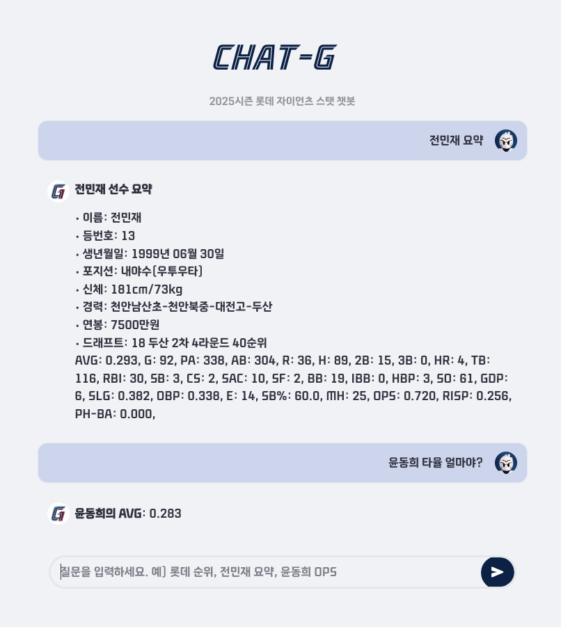
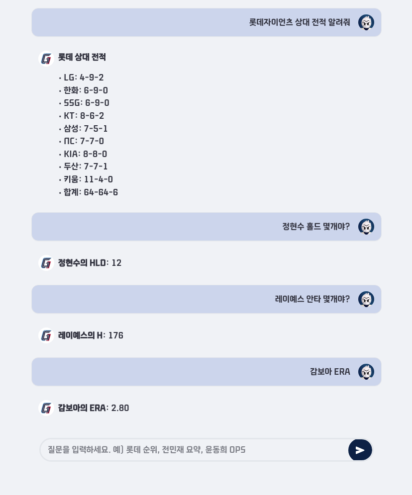

# CHAT-G ⚾
**2025시즌 롯데 자이언츠 스탯 챗봇**

## 주요 기능

- 선수 정보: 전민재 요약, 박세웅 ERA
- 팀 정보: 롯데 요약, 롯데 승률, 롯데 vs LG
- 맞대결 기록: 롯데 이민석 vs 두산 김민석
- 특별 기능: 재밌는 경기, 명경기

## 실행 화면
<p align="center">
  
  
</p>

## 기술 스택
- **Backend**: Python 3.11
- **Web Framework**: Streamlit
- **크롤링**: requests, BeautifulSoup, lxml
- **데이터 처리**: pandas
- **UI/UX**: 커스텀 CSS, [Giants 인라인체](https://github.com/fonts-archive/GiantsInline.git)
## 프로젝트 구조

```
CHAT-G/
├── app/        # 웹앱 (Streamlit)
├── chatbot/    # 챗봇 로직
├── crawler/    # 데이터 크롤링
├── app.py      # 메인 실행 파일
└── requirements.txt

```

## 실행 방법

```bash
pip install -r requirements.txt
streamlit run app.py #웹 
python -m chatbot.main #CLI 
```
챗봇이 `localhost:8501` 에서 실행됩니다.

## 데이터 소스

**KBO 공식 기록실** 크롤링 (robots.txt 및 이용약관 준수)  
이 프로젝트는 개인 학습 및 연구 목적으로 제작되었습니다.
KBO 공식 데이터 사용 시 관련 약관을 준수합니다.